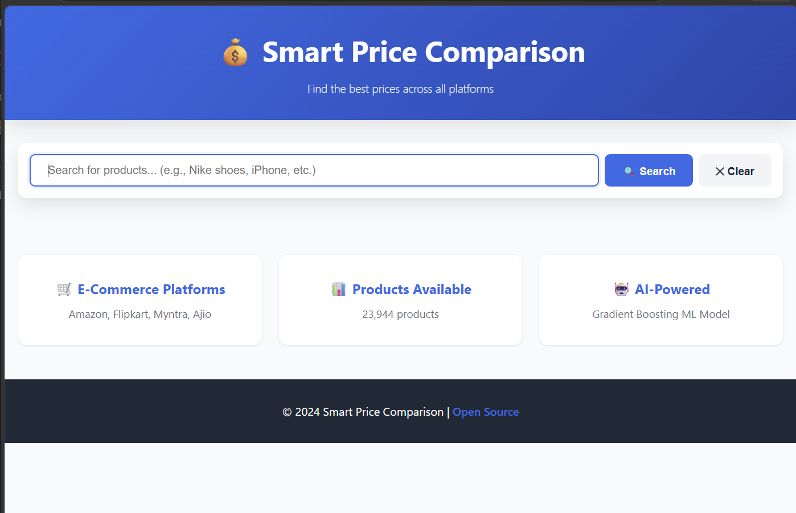

# Smart Price Comparison Website

## Project Title

**Smart Price Comparison Website with ML-based Lowest Price Recommendation**

## Problem Statement

Online shoppers find it difficult to compare prices across multiple e-commerce websites. Manual checking takes time, is error-prone, and makes it hard to identify the lowest price quickly. This project aims to develop a machine learning-powered system that identifies the lowest price for the same product across four websites and recommends the best purchase option.

## Solution Overview

This project builds a price comparison platform that:
- Collects product prices from Amazon, Flipkart, Myntra, and Ajio
- Merges the data into a unified dataset
- Uses a Gradient Boosting model to predict the best platform for each product
- Displays the lowest price and recommended purchase link through a web interface

## Dataset Details

- Source: Kaggle dataset(s) containing product prices and platform information
- Merged dataset filename: `final_price_comparison.csv`
- Dataset includes product information from 4 e-commerce websites:
  - Amazon
  - Flipkart
  - Myntra
  - Ajio
- Data fields include `product_id`, `product_name`, `brand`, `platform`, `price`, and `product_link`
- The merged data is stored in `price-comparison-website/data/final_price_comparison.csv`

## Model Details

The project uses a machine learning model implemented in Python to predict the platform offering the lowest price.

### Model type
- `GradientBoostingClassifier` from `scikit-learn`

### Features used
- Price for each platform: `Amazon`, `Flipkart`, `Myntra`, `Ajio`
- `min_price`, `max_price`, `price_range`, `avg_price`, `std_price`
- Price difference features: `diff_Amazon`, `diff_Flipkart`, `diff_Myntra`, `diff_Ajio`

### Training process
- Data is pivoted by `product_id` and `platform`
- The target label is the platform with the lowest price per product
- Train/test split: 80% train, 20% test
- Model hyperparameters:
  - `n_estimators=100`
  - `learning_rate=0.1`
  - `max_depth=5`
  - `random_state=42`

### Output
- Trained model saved as `backend/model/gradient_boosting_model.pkl`
- Feature metadata saved as `backend/model/features_info.pkl`

## How to Run the Project

### 1. Open the project
```bash
cd price-comparison-website
```

### 2. Install Node.js dependencies
```bash
npm install
```

### 3. Set up Python environment
```bash
python -m venv venv
venv\Scripts\activate  # Windows
# source venv/bin/activate  # Mac/Linux
pip install pandas scikit-learn numpy
```

### 4. Train the ML model
```bash
npm run train
```

### 5. Start the backend server
```bash
npm start
```

### 6. Open the frontend
- Visit `http://localhost:3000` in your browser

## Required Dependencies

### Node.js
- `express`
- `cors`
- `csv-parser`
- `python-shell`
- `nodemon` (development)

### Python
- `pandas`
- `scikit-learn`
- `numpy`

## Project Structure

```
price-comparison-website/
├── backend/
│   ├── server.js
│   ├── services.py
│   ├── model/
│   │   ├── train_model.py
│   │   └── predict.py
├── data/
│   └── final_price_comparison.csv
├── frontend/
│   ├── index.html
│   ├── style.css
│   └── script.js
├── package.json
└── README.md
```


### Expected functionality
- Search for a product name
- View price listings from Amazon, Flipkart, Myntra, and Ajio
- See the lowest price highlighted
- Receive ML-based best platform recommendation
- Click a direct purchase link to open the product page

### Sample output
```text
Search query: "running shoes"
Found 12 matching products.
Amazon: ₹2499
Flipkart: ₹2399
Myntra: ₹2299
Ajio: ₹2350
Best recommendation: Myntra (Lowest price)
```



## Team Members

- Sashmitha C V — `24BCS252`
- Sarumathi R — `24BCS251`
- Sanjitha C — `24BCS242`
- Sathiya Priya M — `24BCS253`

## Notes

- The repository already includes the merged dataset used for training and evaluation.
- The model training script uses the merged CSV dataset from the `data` folder.
- The backend combines CSV lookup with ML recommendations for the final comparison output.

---

Enjoy using the smart price comparison system for faster product price discovery!
